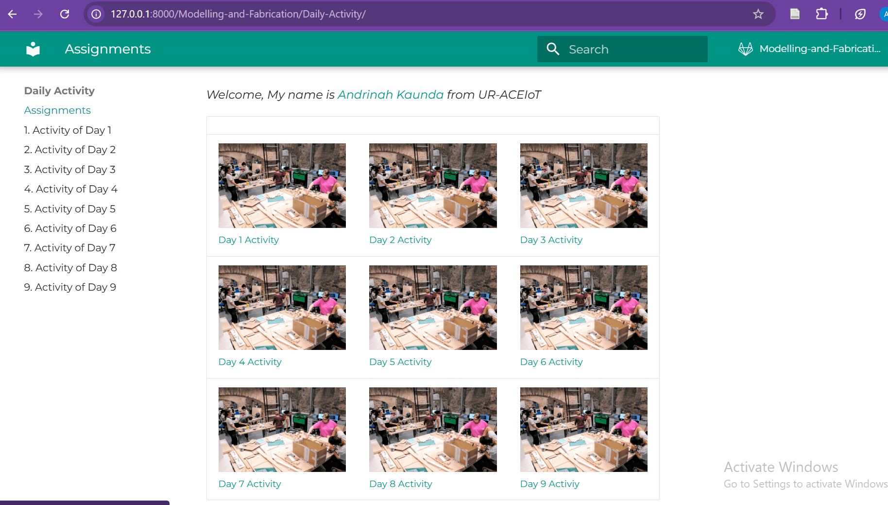
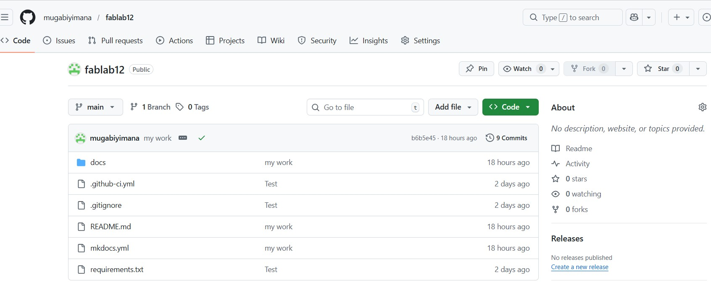
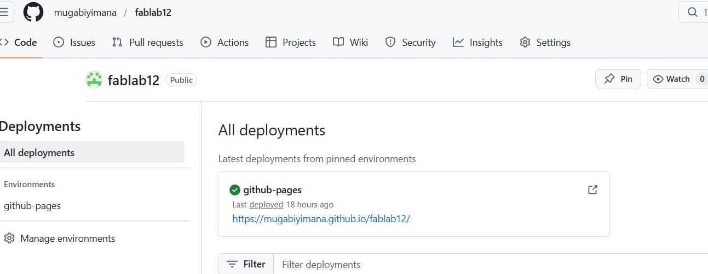

# 1. Activity of Day 1

## Foundations of Modeling & Fabrication

Modeling and Fabrication are inseparable parts of the design process, where computational thinking, material knowledge, and production methods all influence outcomes. Designing is not just about creating forms on a screen, it requires considering how ideas will physically manifest, making fabrication a central factor in shaping design decisions.

**Modeling** is more than representing shapes;
It represnts form, logic, behavior, and intelligence. 

There are different approaches, including:
- Geometric Modelling
- parametric & rule-based modelling
- simulation & data-driven Modelling
    

**Fabrication** transforms these models into physical artifacts, using understanding of materials, machines, and processes.

### Design-to-Fabrication Process
The design process is iterative rather than linear, allowing continuous feedback at every stage. It typically follows these steps:
 - Idea :  Conceptualize the design goals and requirements
 - Model : Creating digital or representations of the design
 - Prototype: Build initial version
 - Fabricate: Produce the physical artifact based on the model
 - Evaluate: test it and use feedback to improve the design

## Activity 1 – Building a Documentation Website with MkDocs Material  

Documentation is a critical part of the design and fabrication process.

### About  Website 

For this activity, I created a documentation website using MkDocs Material to record my digital modeling and fabrication learning journey. 
The site captures course understanding, daily activities, materials used, reflections, and results.

Web Pages:
mk
- **Home** – Contains an introduction and my background

[Home](../images/day_1/liveSite.png){ width=500}

- **Daily Activity** - Shows my course understanding and activities completed throughout the course

{ width=600}

## Activity 2 – Publishing Documentation via GitHub Pages 

### From Local Project to Public Knowledge

In this activity, I have learned how to publish and share technical documentation site using GitHub and GitHub Pages. This allowed the documentation created locally to be accessed as a live website by anyone online.

### Task Description
Uploading MkDocs documentation project to GitHub and publishing it as a live website using GitHub Pages.

#### Uploading local documentation site to Github
- Created a GitHub repository to host the project  
- upload MkDocs project files to GitHub : 
Uploaded the local MkDocs project files to the repository using Git commands in the **Git Bash terminal**, ensuring the files were properly tracked and ready for deployment.
{ width=600}

#### Deploying Website 
- Enabled GitHub Pages  : Activated the GitHub Pages feature in the repository settings, which allows the project files to be hosted as a live website directly from GitHub.
- Deployed the site with a public URL : Once GitHub Pages was enabled, the site became accessible online via a public URL, making the documentation available to anyone without needing access to the repository. 

{ width=600}

- GitHub repository link  
https://github.com/mugabiyimana/fablab12

- Live GitHub Pages URL  
https://github.com/mugabiyimana

#### Result - Git Live Website
{ width = 600}

