# 2. Activity of Day 2
                        Digital Modeling for Fabrication

## Overview

Day 2 focused on digital modeling for fabrication, introducing both 3D parametric modeling and 2D vector design.
The goal was to understand how simple, fabrication-ready geometry is created using appropriate software tools.

Two modeling activities were completed:

    A 3D L-Shaped Mounting Bracket using FreeCAD

    A 2D Press-Fit Box Panel using Inkscape

## Activity 1 – FreeCAD Model  
### L-Shaped Mounting Bracket (3D)

!!! info "Design Goal"
    Create a simple **L-shaped mounting bracket** that demonstrates basic 3D modeling operations used in fabrication.

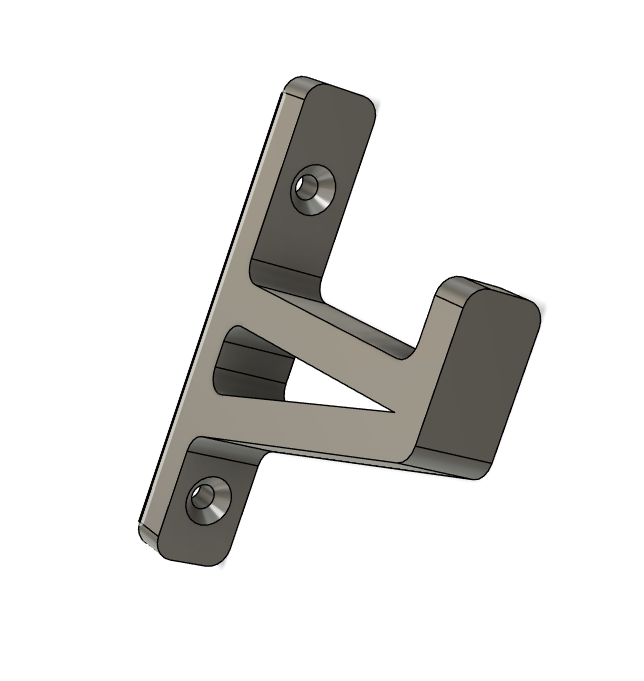{ width=200 align=right }

### Design Characteristics
- Two flat faces at **90°**
- Two circular holes for screws or bolts
- Simple geometry with no complex curves
- One **filleted corner** for safety and manufacturability

### Implementation

#### Modeling Workflow (FreeCAD)

The following steps describe the process used to model the **L-Shaped Mounting Bracket** in FreeCAD.

=== "Step 1 – Base Sketch"

!!! note
    - Created a new sketch on the reference plane  
    - Drew an **L-shaped 2D profile**  
    
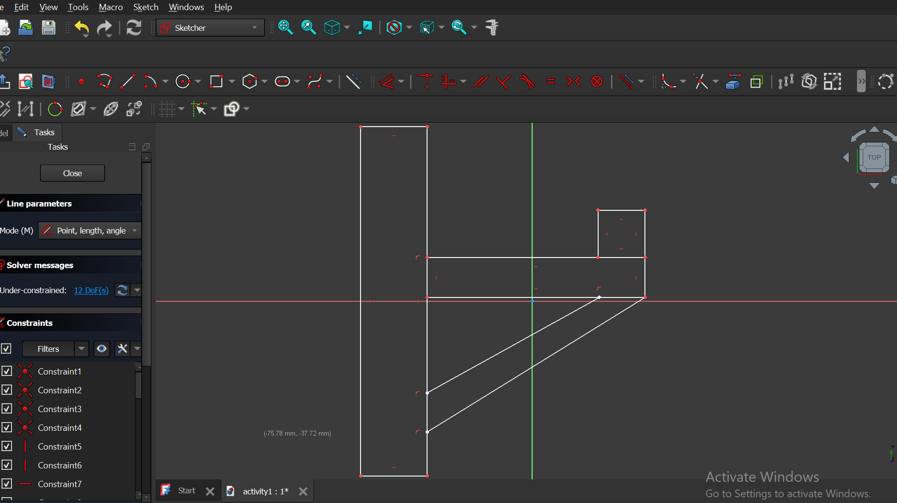{width=400}

---

=== "Step 2 - Constraining the Sketch"

- Applied geometric constraints to control the orientation and relationships between sketch elements  
  (horizontal, vertical, parallel, and perpendicular).
- Applied dimensional constraints to define exact sizes such as lengths, widths, and thickness.
- Ensured the sketch became **fully constrained**, preventing unintended movement (degrees of freedom = 0)

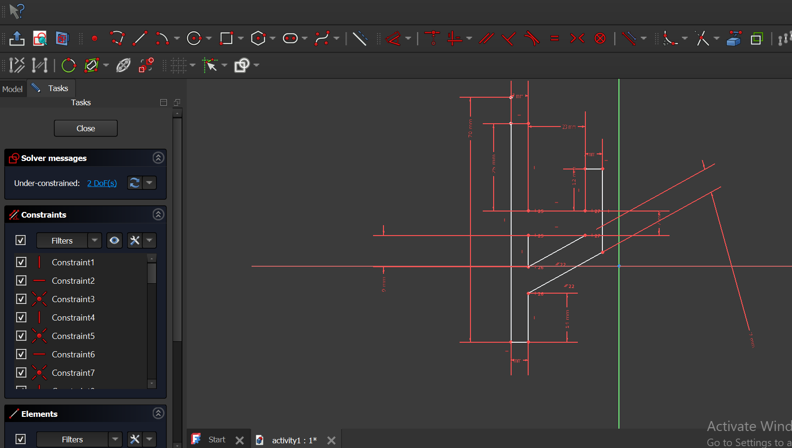{width = 300 align= left}
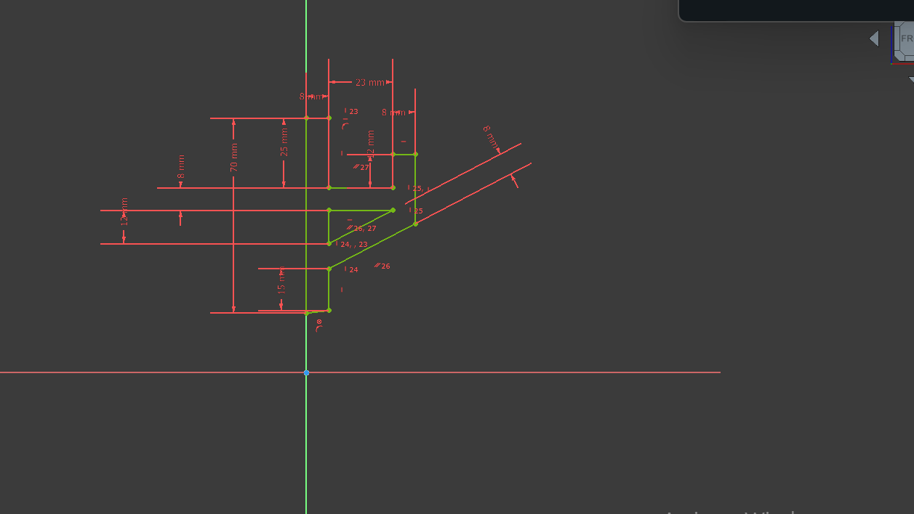{width = 300 }

---

=== "Step 3 – Pad "

    - Used the **Pad** tool to extrude the fully constrained 2D sketch into a 3D solid.
    
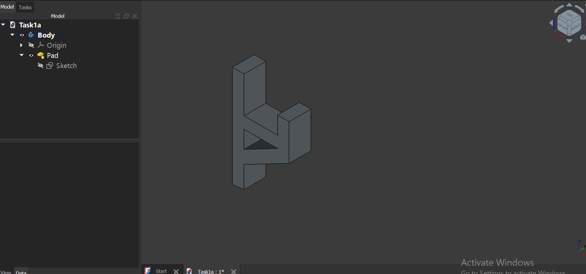{ width = 400}

---

=== "Step 4 – Holes"

    - Selected the appropriate face and sketched **two circular profiles** using the circle tool.
    - Applied an equal constraint to ensure both holes had identical diameters.
    - Positioned the holes symmetrically using geometric constraints.
    - Added **dimensional constraints** to set hole diameters suitable for standard fasteners and fully constrain the sketch.
    - Used the **Pocket** tool with the parameter set from back face to front face to create through-holes.
    - Once that was done, applied **Chamfer** to the two circular edges of the screw holes.

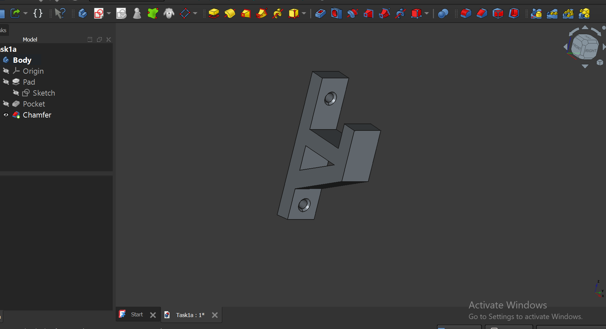{width= 400 }

---

=== "Step 5 – Fillet"

    - Selected the sharp edges to rould of the bracket and
    - Applied **Fillet** to remove the sharpness and make them smooth.

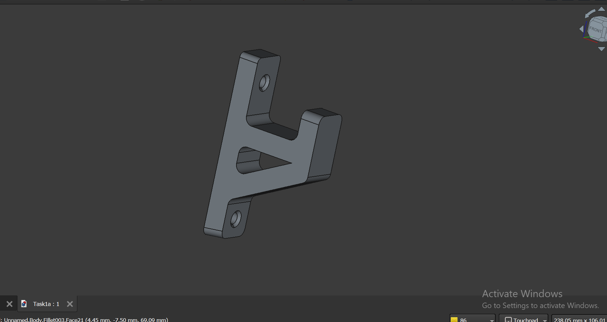{ width = 300 align = left }
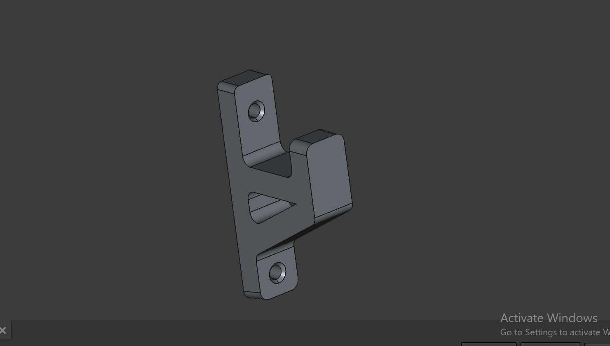{ width = 300 }

---

=== "Result"

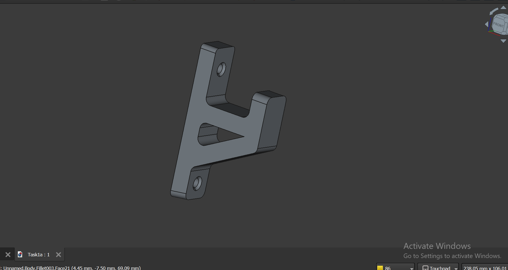{width = 500}

---

### Download reference

[Download the FabLab Day 2 Activity 1](../day_2\activity1.){: .md-button }

---

## Activity 2 – Inkscape Model  
### Press-Fit Box Panel (2D Vector)

!!! info "Design Goal"
    Create a **2D press-fit box panel** using vector geometry that can be laser-cut and assembled
    without fasteners. The focus is on **dimensional accuracy** and **material-aware design**.

### Design Characteristics

- Flat **rectangular panel**
- **Rectangular slots** cut along the edges
- Slot widths sized to match material thickness
- Geometry designed to slide and lock with other panels
- Entirely **2D vector-based design** 

Key considerations:

- 1:1 scale design to ensure accurate real-world dimensions
- Use of clean paths for precise vector geometry
- Slot accuracy – Proper sizing for press-fit assembly

### Modeling Approach (Inkscape)

=== "Step 1 – Create Rectangles"

- Created rectangle shapes representing box panels.
- Added tabs that allow the boxes to fit into each other.

{ width=400 }

---

=== "Step 2 – Union"

- Used the **Union** tool in Inkscape to merge the tabs and box shapes.
- Ensured the sizes were correct so the boxes can fit into each other.

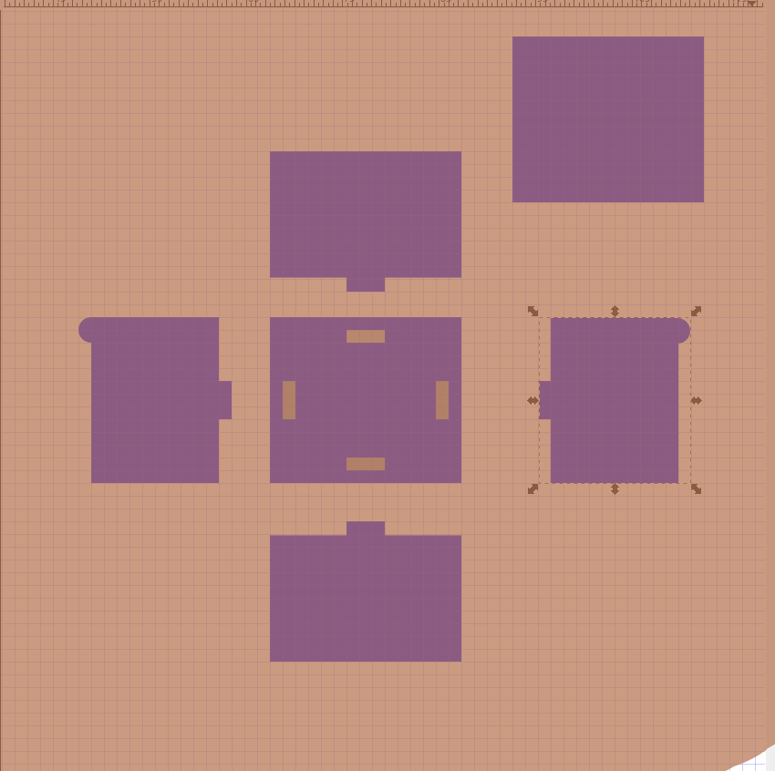{ width=400 }

---

=== "Step 3 – Holes"

- Used the **Difference** tool to create holes in the box panels.

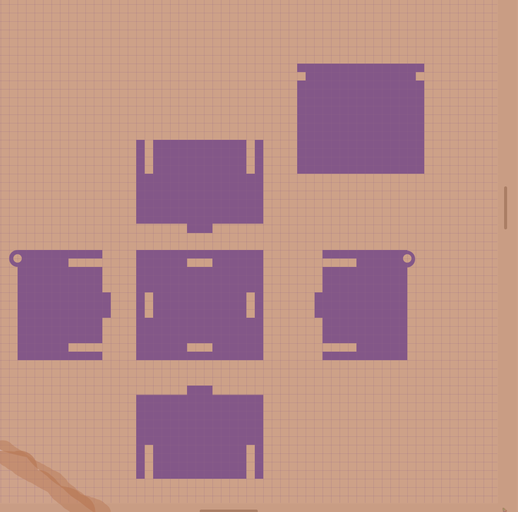{ width=400 }

---

=== "Result"

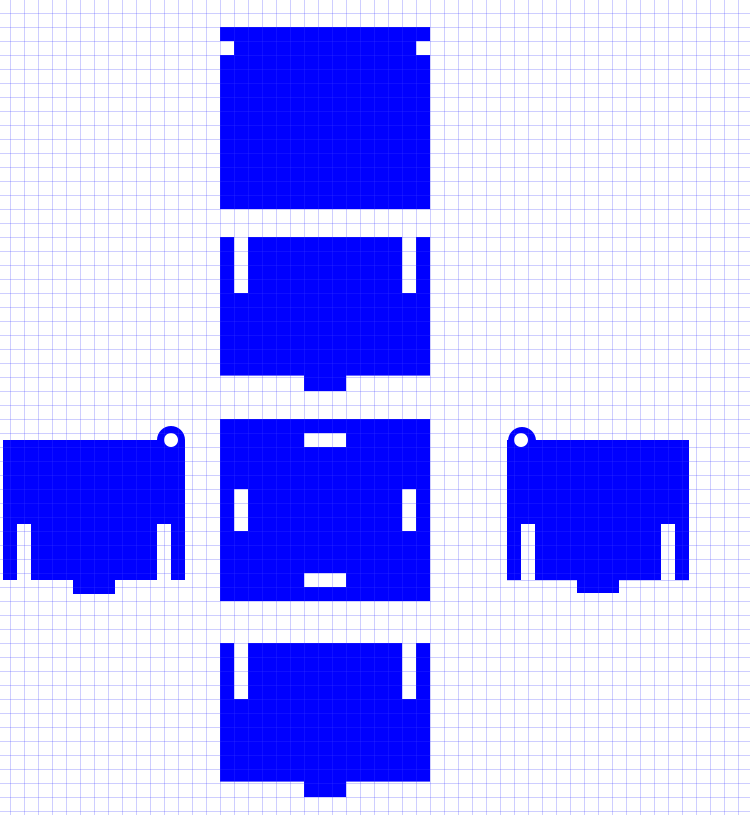{width=500 }
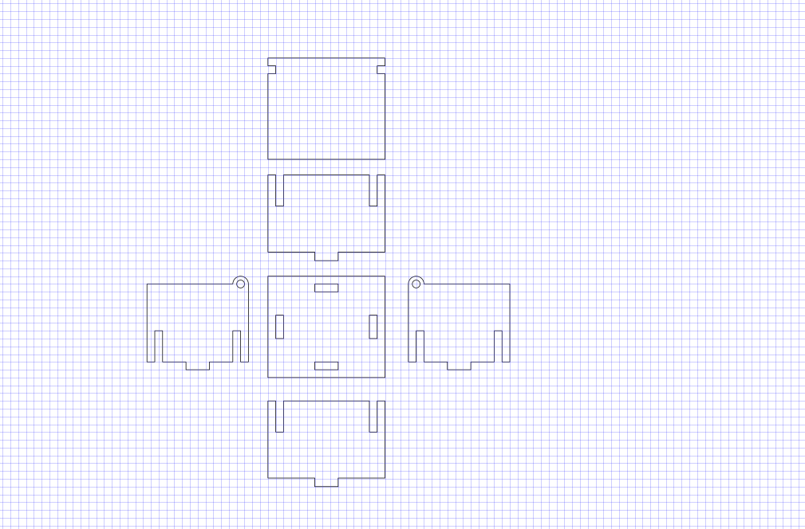{width=500 }

---

### Download Reference - activity 2
[Download Press-Fit Box Panel (Inkscape File)](../files/Press-FitBoxPanelDrawing.svg){: .md-button }
