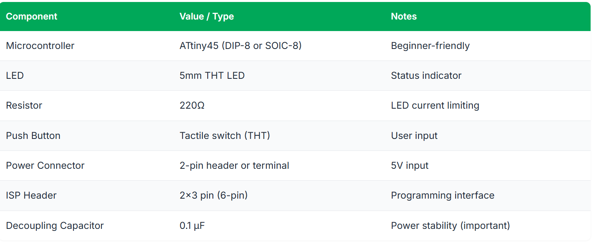
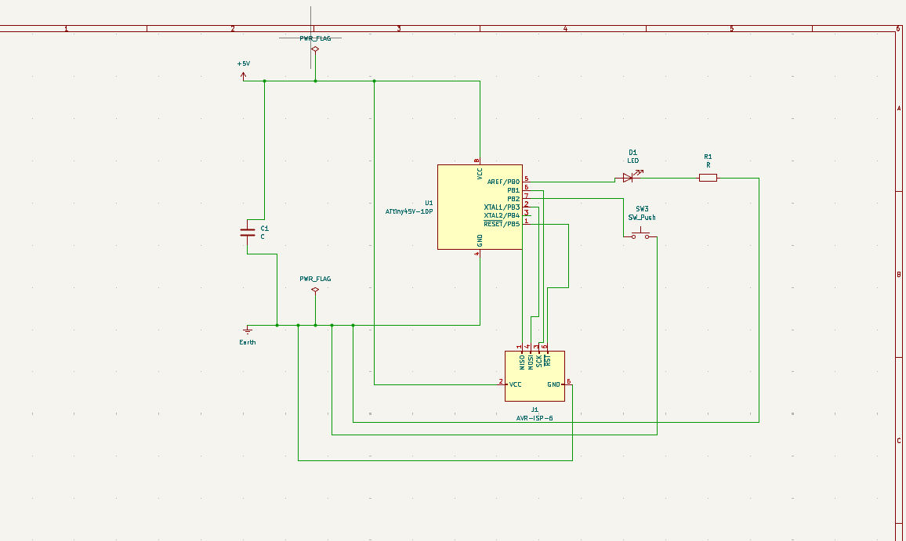
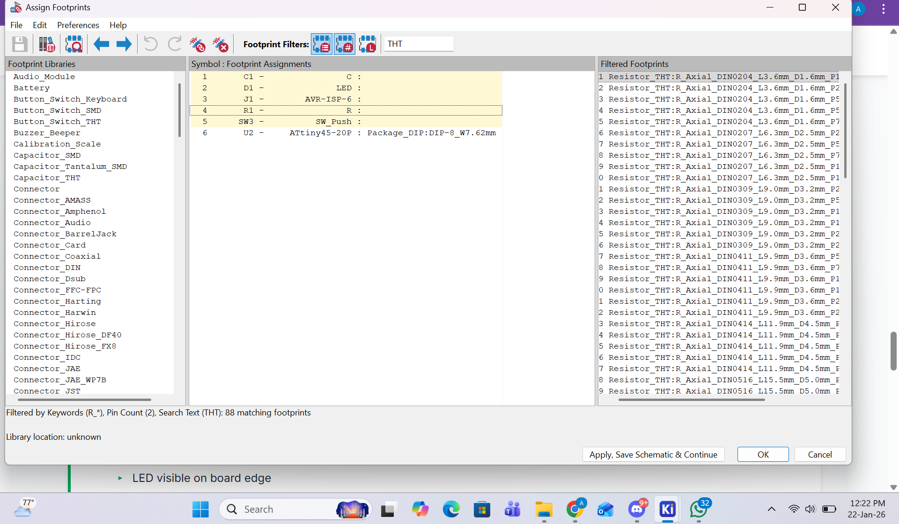
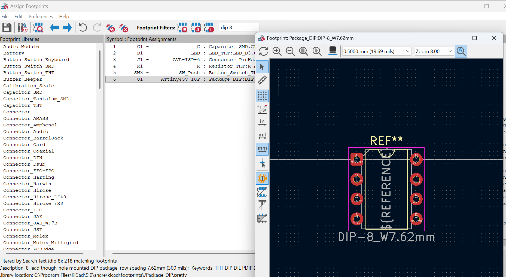
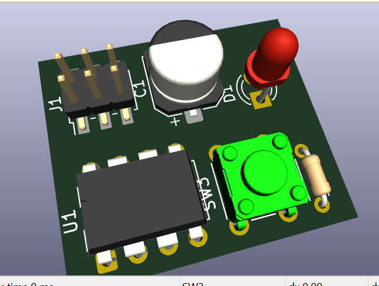
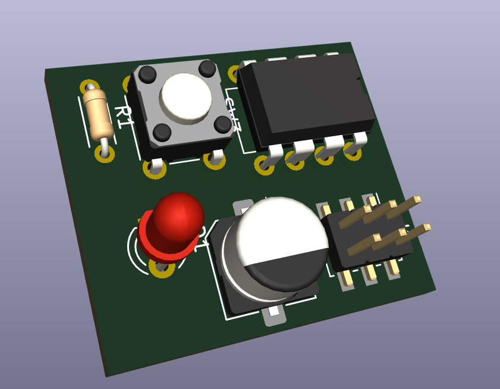
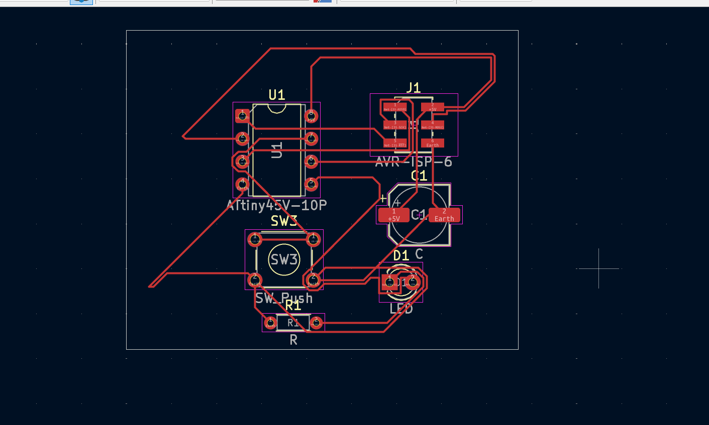
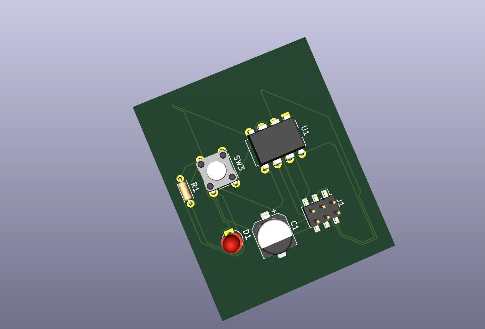

# 3. Activity of Day 3  
##                          PCB Milling Techniques & Fabrication Process

### Overview

Day 3 focused on PCB design for fabrication, specifically the creation of a single-sided microcontroller PCB using KiCad.
The main objective was to understand the complete workflow from schematic design to PCB layout and preparation for milling and soldering.

### Kicad Software
**Kicad** is a free and open-source PCB design software that supports the entire PCB development cycle, from schematic capture to generating fabrication-ready files.

#### KiCad Workflow
Each step builds on the previous one to ensure a robust and functional final product:

    1. Schematic Creation - Define electrical connections.
    2. Footprint Assignment - Link logical symbols to physical layouts.
    3. PCB Layout - Arrange components and route traces.
    4. Design Rule Check - Validate against manufacturing constraints.
    5. Fabrication Files - Generate outputs for manufacturing.

### Activity - Single-Sided Microcontroller PCB Design (KiCad) 

#### Objective
Designing a single-sided PCB using KiCad that:
- Uses an ATtiny45 microcontroller
- Controls an LED using a push button
- Can be programmed via a 6-pin ISP header
- Is suitable for PCB milling and hand soldering

#### Block Diagram (Conceptual)

{ width=500 }

#### Components Specification
{ width=500 }

#### Design Workflow (KiCad)

=== "Step 1 – Schematic Design"

    The schematic was created in KiCad by placing all components and connecting them correctly according to the circuit design specification.

{ width=600 }

=== "Step 2 – Assign Footprints"

    Each component in the schematic was assigned a suitable physical footprint to match the actual components used during fabrication.

{ width=500 }

{ width= 500 }

=== "Step 3 – PCB Layout (Single-Sided)"

    - Converted the schematic to PCB layout  
    - Arranged components for a single-sided board  

{ width=400 }

{ width=400 }

=== "Step 4 – Design Routing and Check "

    - Routed tracks manually to avoid overlaps    
    - Ensured the design was suitable for PCB milling  
    - Verified there were no errors 
        - No unconnected nets
        - No trace overlap

{ width=400 }

=== "Step 5 – Final Routed Board"

The final routing was reviewed to confirm all connections were correct and ready for fabrication.

{ width=400 }
{ width=400 }

### Reflection

- **Challenges:** Routing the PCB was challenging because once a trace occupies a path, another trace cannot cross it. This became especially difficult in areas with many connections, and had to change position of routes or change route width.

- **What I learned:**
    - Component placement is critical in single-sided PCB design
    - Good planning reduces routing complexity
    - Designing for fabrication requires thinking ahead, not just connecting nets

---

## Download Reference 

[Download Microcontroller PCB Design (KiCad Folder)](../files/Microcontroller_PCB_Design.zip){ .md-button .md-button--primary }
