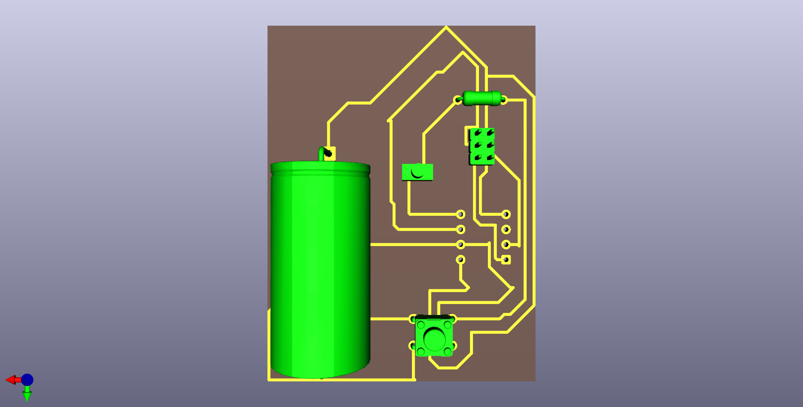
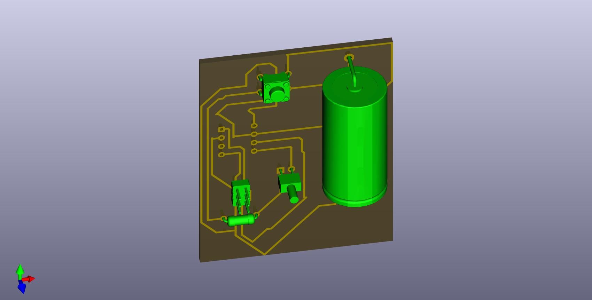

# 3. Activity of Day 3

# Single-Sided Microcontroller PCB Design (KiCad)

## ATtiny45 LED Control with Push Button & ISP Programming

---

## Objective

The objective of this activity is to design a **single-sided PCB** using **KiCad** based on a real microcontroller system.  
Students will create a board that:

- Uses an **ATtiny45 microcontroller**
- Controls an **LED using a push button**
- Can be programmed via a **6-pin ISP header**
- Is suitable for **PCB milling** and **hand soldering**

This is a complete embedded system design, not a demo circuit.

---

## Functional Description

- The **ATtiny45 runs at 5V**
- The **LED turns ON when the push button is pressed**
- The program is uploaded using an **ISP programmer**
- The board is powered using an **external 5V connector**

---

##  Diagrams

