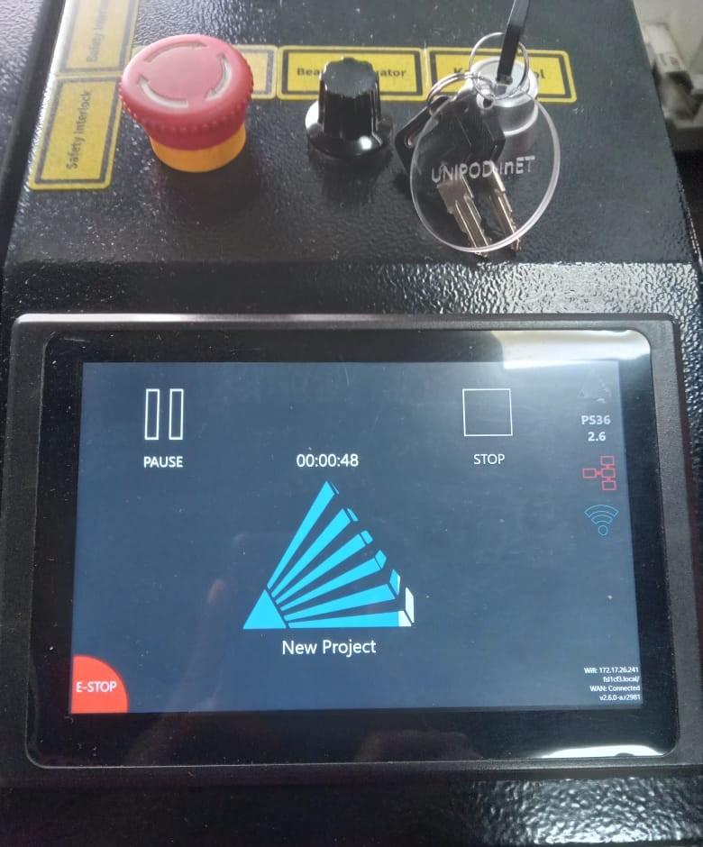

# 4. Activity of Day 4

# Laser Cutting Machine Activity

## Computer-Aided Design and Digital Fabrication Using Laser Cutter

---

## Objective

The objective of this activity is to introduce students to **laser cutting technology** for digital fabrication.  
Students will design a 2D object using vector-based software and fabricate it using a **laser cutting machine**.

By the end of this task, students will understand the full workflow from **digital design to physical production**.

---

## Functional Description

- Students design a **2D vector file**
- The design is prepared according to **laser cutting constraints**
- The file is sent to a **laser cutting machine**
- The final object is cut from sheet material such as plywood or acrylic

---

## Machine Used

**Laser Cutting Machine**

Common types:
- CO₂ Laser Cutter
- Desktop or Industrial Laser Cutter

---

## Materials

| Material | Thickness | Notes |
|--------|-----------|------|
| Plywood | 3 mm | Easy to cut, beginner-friendly |
| Acrylic | 3 mm | Clean edges, requires ventilation |
| Cardboard | 2–3 mm | Good for testing designs |

---

## Tools & Software

- **Design Software**
  - Inkscape
  
- **Laser Control Software**
  - LightBurn
  - RDWorks
  - LaserGRBL
- **Laser Cutter Machine**

---

## Safety Precautions

 **Laser safety is critical**

Students must:

- Never leave the laser cutter unattended
- Wear safety glasses if required
- Ensure proper ventilation is ON
- Keep flammable materials away
- Stop the machine immediately if fire occurs
- Be supervised by a trained instructor

---

## Design to Fabrication Workflow

### Step 1 – Design the 2D Model

Students must:

- Create a **2D vector design**
- Use **closed paths only**
- Convert all lines to vectors
- Use real dimensions (mm)

Recommended:
- Object size smaller than **300 × 200 mm**

---

### Step 2 – Design Rules for Laser Cutting

| Rule | Value |
|----|------|
| Stroke color | Red (RGB: 255, 0, 0) |
| Stroke width | 0.01 mm (hairline) |
| Units | Millimeters |
| No fills | Cutting only |

> Note: Different labs may use different color rules.

---

### Step 3 – Prepare the Laser File

Students must:

- Check scale and dimensions
- Remove duplicate lines
- Place objects efficiently to reduce material waste
- Export as:
  - `.SVG`
  - `.DXF`
  - `.PDF`

---

### Step 4 – Machine Setup

Students must:

- Turn ON:
  - Laser cutter
  - Air assist
  - Ventilation system
- Place material flat on the bed
- Focus the laser head correctly
- Set the **origin** (home position)

---

### Step 5 – Laser Cutting Parameters (Example)

| Material | Power (%) | Speed (mm/s) | Passes |
|--------|----------|--------------|--------|
| 3 mm plywood | 70–80 | 10–15 | 1 |
| 3 mm acrylic | 60–70 | 8–12 | 1 |
| Cardboard | 30–40 | 20–25 | 1 |

 Parameters may vary depending on the machine.

---

### Step 6 – Cutting Process

- Run a **frame test**
- Start the cutting job
- Monitor the process continuously
- Pause or stop if issues occur

---

### Step 7 – Post-Processing

Students must:

- Remove the cut pieces carefully
- Clean burnt edges if necessary
- Test fit components
- Record any design or cutting issues

---

## Example Laser-Cut Project

**Press-Fit Box / Key Holder / Phone Stand**

Design considerations:
- Material thickness tolerance
- Kerf compensation
- Tab and slot fit

