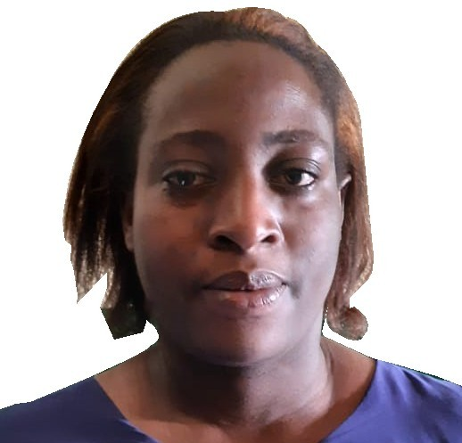

# My documentation

Welcome to my digital fabrication and modeling documentation website.  

This site serves as a record of my learning process, design workflows, and practical work completed throughout the  Modelling and Fabrication course.

## About me

{ width=200 align=right }

Hi! My name is **MUGABIYIMANA ELYSE**.  
I am a Masters student pursuing a degree in IoT Embedded Computing Systems at the University of Rwanda, African Centre of Excellence.
My main areas of interest are machine learning and cloud computing , which I plan to integrate with IoT during my time here.

## My background

I am originally from Rwanda and I hold a Bachelor of Science Degree in Computer Science from the University of Rwanda College of Science and Technology.

<!-- This below clears both sides under "aligned" images - see two images above.
Can also be used just as "clear: right;" rather than "clear: both;", if you are using an image on the right, for example.
-->

  

